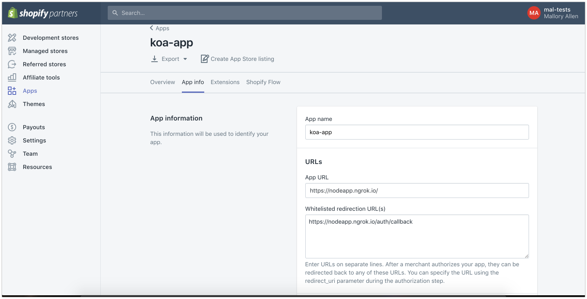

# Unite 2018 - React/Node App Workshop

In this repo you'll find everything you need to follow along with the workshop.

## Before starting

The following steps should be done before you start the workshop

### Install Node (and npm)

Install the latest LTS version of node from [the official site](https://nodejs.org/en/download/). This will include the npm client we'll use to install dependencies.

### Install git

We'll be using git heavily in this workshop, and you'll especially need it if you fall behind.

### Expose your dev environment to the internet

You will need to download [ngrok](https://ngrok.com/download) and sign-up for a free account. Move the unzipped ngrok client to your user folder and run the following in your terminal.

```bash
$ ./ngrok http 3000
```

This should display a UI in your terminal with the public URL of your tunnel and other status and metrics information about connections made over your tunnel. It should look something like this:


### Set up an App on the partners dashboard

Log into the [partner dashboard](https://partners.shopify.com/organizations) and click "Apps" from the main dashboard navigation. Then click "Create app".

Give your app a name, this can be anything you'd like.

Set the app URL to the public URL of your ngrok tunnel. This should be displayed in the UI under "Forwarding" and should start with `https` and end with `.ngrok.io`. For example `https://e3fd01a0.ngrok.io`.

In the workshop we'll be using `/auth/callback` as our oauth callback route, so add that to your whitelist.



For example, for the address above you would add `https://e3fd01a0.ngrok.io/auth/callback`.

### Set up your repository

Clone this repository:<br/>
`git clone -b devdegree git@github.com:Shopify/unite-react-node-app-workshop.git`

In your project root folder, rename the file `.env.example` to `.env`. Copy-paste your Shopify API Key and Shopify API Secret Key to this file. These can be found in the partners dashboard on the **App Info** page under **App credentials** (near the bottom of the page).

```
SHOPIFY_API_KEY=YOUR_SHOPIFY_API_KEY
SHOPIFY_SECRET=YOUR_SHOPIFY_SECRET
```

## Starting the app

Install the dependencies by running the following command in the project root:<br/>
`npm install`

(If you get a `401 Unauthorized` error you may need to remove the file `~/.npmrc` and try again.)

And finally run the app:<br/>
`npm start`

Open a browser and go to either [localhost:3000](localhost:3000) or the URL provided by ngrok.

If successful, you should see a hello message in your browser.

If you ran into any issues with the above steps, please reach out to matt.seccafien@shopify.com before the workshop.

## What's included

We have pre-configured a number of tools to get started quickly. You do not need to have a deep understanding of them for this workshop, however feel free to learn more about them in the following links.

* [babel](https://babeljs.io/) lets us use modern syntax and JSX everywhere
* [webpack](https://webpack.js.org/) compiles our client-side code into a bundle
* [prettier](https://prettier.io/) make our code look pretty and maintains consistency
* [dotenv](https://github.com/motdotla/dotenv) helps configure our environment variables
* [koa](https://koajs.com/) minimalistic and modern Node server framework

## Get started
Follow the workshop instructions in [workshop.md](./workshop.md).
